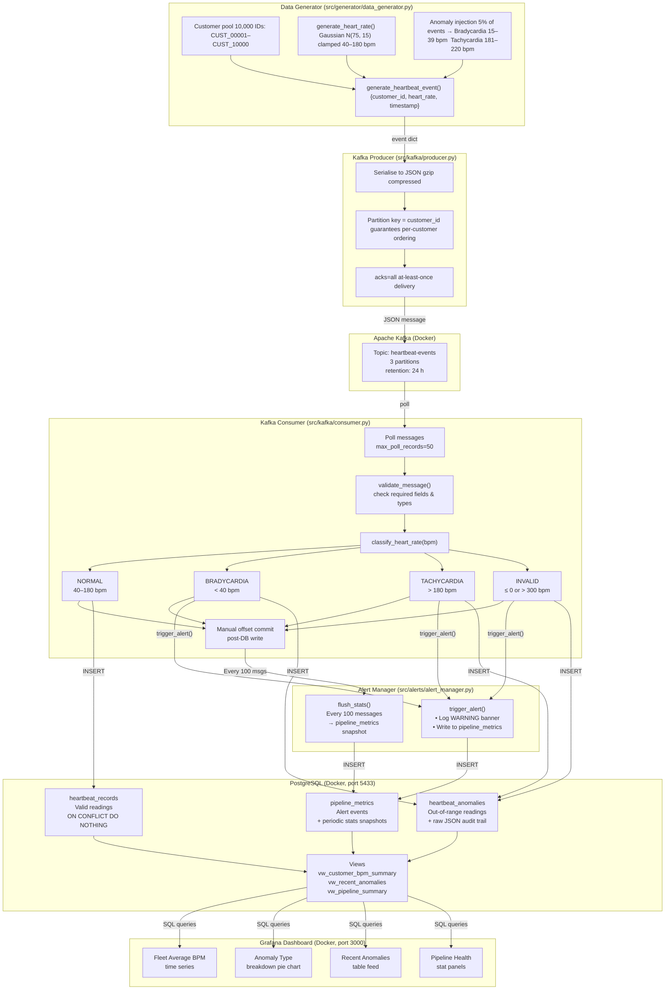
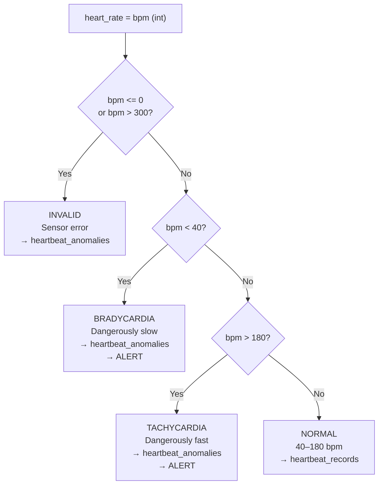
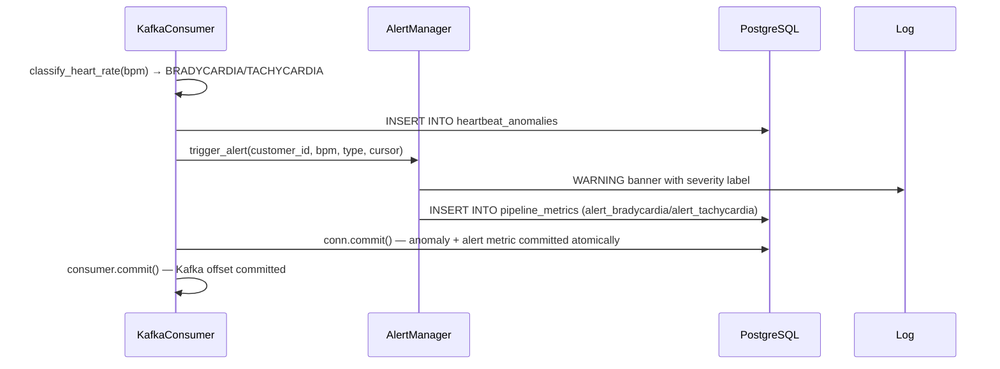

# Data Flow Diagram — Real-Time Customer Heartbeat Monitoring System

> **Export to image/PDF:** Open this file in VS Code with the Mermaid Preview
> extension, or paste the diagram block into [mermaid.live](https://mermaid.live)
> and export as PNG or SVG for submission.

---

## Full System Data Flow

---

## Component Responsibilities

| Component | Input | Output | Technology |
|---|---|---|---|
| Data Generator | None (synthetic) | Heartbeat event dicts | Python `random`, `gauss` |
| Kafka Producer | Event dicts | Compressed JSON messages | `kafka-python` |
| Kafka Broker | Messages from producer | Partitioned, replicated log | Confluent CP 7.6.1 |
| Kafka Consumer | Raw bytes from topic | Validated, classified records | `kafka-python` |
| Alert Manager | Anomaly classification | Log banner + DB metric row | Python logging |
| PostgreSQL | INSERT statements | Persisted records + views | PostgreSQL 15 |
| Grafana | SQL queries | Visual dashboards | Grafana 10.4 |

---

## Heart Rate Classification Decision Tree

---

## Anomaly Alert Flow

---

*Generated: 2026-02-20 | System: Real-Time Customer Heartbeat Monitoring*
